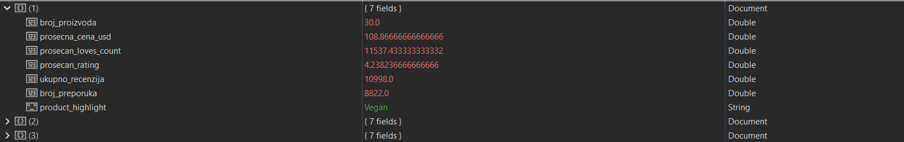
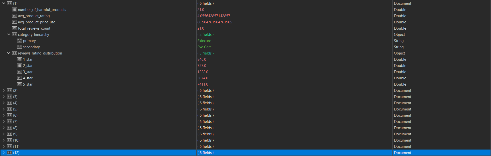
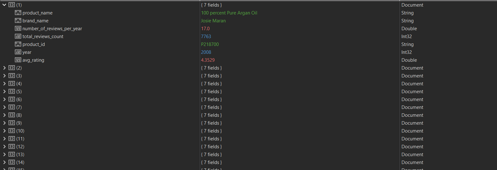
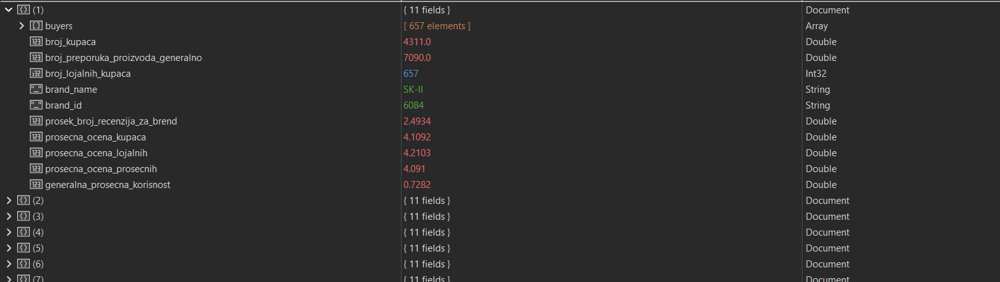

# Upiti

## Korisne naredbe
``` 
// Korisne naredbe!
// Za pokretanje dobavljanja informacija o izvršavanju: db.<collection_name>.explain("executionStats").aggregate([...]);
// Za brisanje keširanih upita: db.<collection_name>.getPlanCache().clear()
``` 

## Upit 1

### Tekst upita: 
Analiza hajpa i tagova - Da li proizvodi koji imaju tag 'Vegan' ili ‘Clean + Planet Positive’ u polju highlights imaju značajno višu prosečnu cenu i veći broj lajkova (loves_count) u odnosu na standardne proizvode i da li se oni češće preporučuju?

### Kod upita: 
``` 
db.getCollection("product_info").aggregate([
    {
        // Faza 1: kreiranje novih polja u odnosu na vrednosti polja highlights
        $addFields: {
            "is_vegan": { $in: ["Vegan", "$highlights"] },
            "is_clean_positive": { $in: ["Clean + Planet Positive", "$highlights"] }
        }
    },
    {
        // Faza 2: kreiranje polja koje ce se koristiti za grupisanje kasnije
        $addFields: {
            "product_highlight": {
                $switch: {
                    branches: [
                        { case: { $and: [{ $eq: ["$is_vegan", true] }, { $eq: ["$is_clean_positive", true] }] }, then: "Both" },
                        { case: { $eq: ["$is_vegan", true] }, then: "Vegan" },
                        { case: { $eq: ["$is_clean_positive", true] }, then: "Clean + Planet Positive" }
                    ],
                    default: "Standard"
                }
            }
        }
    },
    {
        // Dodatna faza: uradjeno dodatno samo kako bi se moglo zapravo izvrsiti, u optimizovanoj verziji
        $limit: 500
    },
    {
        // Faza 3: spajanje sa tabelom recenzija
        $lookup: {
            from: "reviews",
            localField: "product_id",
            foreignField: "product_id",
            as: "product_reviews",
            pipeline: [
                {
                    $group: {
                        "_id": null,
                        "broj_recenzija_proizvoda": { $sum: 1 },
                        "broj_preporuka_proizvoda": { $sum: { $cond: ["$is_recommended", 1, 0] } }
                    }
                }
            ]
        }
    },
    {
        // Faza 4: izdvajanje proizvoda koji imaju recenzije
        $match: {
            $expr: { $gt: [{ $size: "$product_reviews"}, 0]}
        }
    },
    {
        // Faza 5: grupisanje po dobijenim highlights
        $group: {
            "_id": "$product_highlight",
            "broj_proizvoda": { $sum: 1 },
            "prosecna_cena_usd": { $avg: "$price_usd" },
            "prosecan_loves_count": { $avg: "$loves_count" },
            "prosecan_rating": { $avg: "$rating" },
            "ukupno_recenzija": { $sum: "$product_reviews.broj_recenzija_proizvoda" },
            "broj_preporuka": { $sum: "$product_reviews.broj_preporuka_proizvoda" }
        }
    },
    {
        // Faza 6: Sortiranje
        $sort: { "prosecna_cena_usd": -1 }
    },
    {
        // Faza 7: ispis rezultata
        $project: {
            "_id": 0,
            "product_highlight": "$_id",
            "broj_proizvoda": 1,
            "prosecna_cena_usd": 1,
            "prosecan_loves_count": 1,
            "prosecan_rating": 1,
            "ukupno_recenzija": 1,
            "broj_preporuka": 1
        }
    }
],
    { allowDiskUse: true });
```

### Rezultat upita: 



### Performanse:
Vreme trajanja upita: 10:39.061
- Napomena: Ovakav kod koji je dostupan, sadrži i dodatnu *$limit: 500* etapu koja će biti obrisana kad se bude radilo nad optimizovanom verzijom. Ta etapa je dodata iz razloga što je trajanje upita bez nje prešlo trajanje od 5 sati, ali se upit još uvek nije izvršio!

Uočavanje uskih grla:


- Uočena su uska grla..

## Upit 2: 

### Tekst upita:
Detekcija "Štetnih" sastojaka kroz kategorije - U kojim se kategorijama (primarna/sekundarna) proizvoda najčešće pojavljuju neželjeni sastojci (npr. 'Alcohol', 'Paraben', 'Sulfate') i prikazati prosečnu cenu proizvoda i prosečan rating proizvoda iz tih kategorija, uz prikaz raspodele ocena. 

### Kod upita: 
``` 
db.getCollection("product_info").aggregate([
    {
        // Faza 1: razmotavanje niza sastojaka zbog regex pretrage po elementima
        $unwind: "$ingredients"
    },
    {
        // Faza 2: pronalazak proizvoda sa štetnim sastojcima
        // Lista za match dobijena ovde: https://www.ewg.org/the-toxic-twelve-chemicals-and-contaminants-in-cosmetics
        // Dodatno je pretrazeno i Sulfate
        $match: {
            $or: [
                { $expr: { $regexMatch: { input: "$ingredients", regex: "Formaldehyde", options: "i" } } },
                { $expr: { $regexMatch: { input: "$ingredients", regex: "Paraformaldehyde", options: "i" } } },
                { $expr: { $regexMatch: { input: "$ingredients", regex: "Methylene glycol", options: "i" } } },
                { $expr: { $regexMatch: { input: "$ingredients", regex: "Quaternium 15", options: "i" } } },
                { $expr: { $regexMatch: { input: "$ingredients", regex: "Mercury", options: "i" } } },
                { $expr: { $regexMatch: { input: "$ingredients", regex: "Phthalate", options: "i" } } },
                { $expr: { $regexMatch: { input: "$ingredients", regex: "Paraben", options: "i" } } },
                { $expr: { $regexMatch: { input: "$ingredients", regex: "phenylenediamine", options: "i" } } },
                { $expr: { $regexMatch: { input: "$ingredients", regex: "PFA", options: "i" } } },
                { $expr: { $regexMatch: { input: "$ingredients", regex: "Sulfate", options: "i" } } }
            ]
        }
    },
    {
        // Faza 3: grupisanje po proizvodu da uklonimo duplikate ako proizvod ima više štetnih sastojaka
        $group: {
            _id: "$_id",
            product_id: { $first: "$product_id" },
            product_name: { $first: "$product_name" },
            rating: { $first: "$rating" },
            price_usd: { $first: "$price_usd" },
            primary_category: { $first: "$primary_category" },
            secondary_category: { $first: "$secondary_category" },
            tertiary_category: { $first: "$tertiary_category" }
        }
    },
    {
        // Faza 4: spajanje proizvoda sa njihovim recenzijama kako bismo videli raspodelu ocena
        $lookup: {
            from: "reviews",
            localField: "product_id",
            foreignField: "product_id",
            as: "raw_reviews"
        }
    },
    {
        // Faza 5: razmotavanje niza recenzija kako bismo ih mogli ispravno prebrojati
        $unwind: "$raw_reviews"
    },
    {
        // Faza 6: prvo grupisanje po proizvodu i brojanje ocena
        $group: {
            _id: {
                product_id: "$product_id"
            },
            primary: { $first: "$primary_category" },
            secondary: { $first: "$secondary_category" },
            product_static_rating: { $first: "$rating" },
            product_price_usd: { $first: "$price_usd" },
            total_reviews_count: { $sum: 1 },
            stars_1: { $sum: { $cond: [{ $eq: ["$raw_reviews.rating", 1] }, 1, 0] } },
            stars_2: { $sum: { $cond: [{ $eq: ["$raw_reviews.rating", 2] }, 1, 0] } },
            stars_3: { $sum: { $cond: [{ $eq: ["$raw_reviews.rating", 3] }, 1, 0] } },
            stars_4: { $sum: { $cond: [{ $eq: ["$raw_reviews.rating", 4] }, 1, 0] } },
            stars_5: { $sum: { $cond: [{ $eq: ["$raw_reviews.rating", 5] }, 1, 0] } }
        }
    },
    {
        // Faza 7: drugo grupisanje po kategorijama (primarna i sekundarna) i brojanje ocena
        $group: {
            _id: {
                primary: "$primary",
                secondary: "$secondary"
            },
            number_of_harmful_products: { $sum: 1 },
            avg_product_rating: { $avg: "$product_static_rating" },
            avg_product_price_usd: { $avg: "$product_price_usd" },
            total_reviews_count: { $sum: 1 },
            total_stars_1: { $sum: "$stars_1" },
            total_stars_2: { $sum: "$stars_2" },
            total_stars_3: { $sum: "$stars_3" },
            total_stars_4: { $sum: "$stars_4" },
            total_stars_5: { $sum: "$stars_5" },
        }
    },
    {
        // Faza 8: projektovanje konacnog dokumenta
        $project: {
            _id: 0,
            category_hierarchy: "$_id",
            number_of_harmful_products: 1,
            avg_product_rating: 1,
            avg_product_price_usd: 1,
            total_reviews_count: 1,
            reviews_rating_distribution: {
                "1_star": "$total_stars_1",
                "2_star": "$total_stars_2",
                "3_star": "$total_stars_3",
                "4_star": "$total_stars_4",
                "5_star": "$total_stars_5"
            }
        }
    },
    {
        // Faza 9: opadajuce sortiranje, kategorije sa najvise stetnih proizvoda izbijaju na vrh
        $sort: { count: -1 }
    }
],
    { allowDiskUse: true });
```

### Rezultat upita: 



### Performanse:
Vreme trajanja upita: 10:39.061

Uočavanje uskih grla:


- Uočena su uska grla..

## Upit 3 

### Tekst upita: 
Strategija popusta - Koji brendovi najagresivnije koriste popuste (najveća razlika između price_usd i sale_price_usd) i da li su ti popusti rezervisani samo za Limited Edition proizvode? 

### Kod upita: 
``` 
``` 

### Rezultat upita: 



### Performanse:
Vreme trajanja upita: 10:39.061

Uočavanje uskih grla:


- Uočena su uska grla..

## Upit 4

### Tekst upita: 
...

### Kod upita: 
``` 
``` 

### Rezultat upita: 



### Performanse:
Vreme trajanja upita: 10:39.061

Uočavanje uskih grla:


- Uočena su uska grla..


## Upit 5

### Tekst upita: 
...

### Kod upita: 
``` 
``` 

### Rezultat upita: 


### Performanse:
Vreme trajanja upita: 10:39.061

Uočavanje uskih grla:


- Uočena su uska grla..
