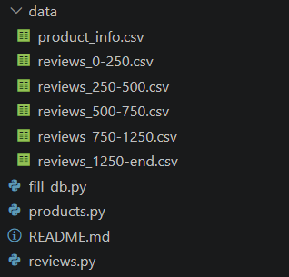

# Uputstvo za pokretanje i upotrebu skripte za popunjavanje inicijalne sheme baze podataka

Pokretanje: ```python fill_db.py```

Potrebni paketi:
- PyMongo, instalacija: ```pip install pymongo```
- dateutil, instalacija: ```pip install python-dateutil```
- tqdm, instalacija: ```pip install tqdm```
- Sve zajedno: ```pip install pymongo python-dateutil tqdm```

Očekivani parametri:
- Struktura direktorijuma: Skripta očekuje da su datoteke iz samog skupa podataka nalaze u direktorijumu *data* i na slici ispod je prikazana očekivana struktura */initial/scripts* direktorijuma.



- Baza podataka: Skripta očekuje da je MongoDB pokrenut na *localhost:27017* i kreirana baza će imati naziv *SBP-Projekat-initial*.